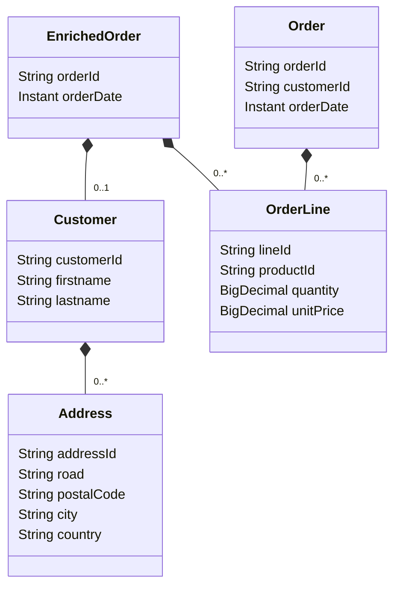

# Kafka exploration project

## Table of content

* [Description](#description)
* [Setup](#setup)
* [Sub projects explained](#sub-projects)
  * [avro-schema](#avro-schema)
  * [ksqldb](#ksqldb)
  * [plain-json](#plain-json)

## Description

Three projects so far:

* plain-json
* avro-schema
* ksqlDB

In the first one, `plain-json`, records in topics are serialized as `String`, for key and data.

In the second, `avro-schema`, records in topics are serialized and validated using Avro Schema in the Kafka Registry.

In the third one `ksqlDB`, the records come from the second project, and I'm using KSqlDB to apply operation to these data.

## Setup

### Docker Compose

There are two docker compose files. One with all but `ksqldb` server, the other one with it.

The Docker Compose contains 6 containers:

| type       | instance name   | exposed ports       | compose file                                       |
|------------|-----------------|---------------------|----------------------------------------------------|
| zookeeper  | zookeper        | -                   | docker-compose.yaml<br/> docker-compose-ksqldb.yaml |
| kafka      | broker          | 29092 / 9092 / 9101 | docker-compose.yaml<br/> docker-compose-ksqldb.yaml |
| registry   | schema-registry | 9081                | docker-compose.yaml<br/> docker-compose-ksqldb.yaml     |
| akhq       | akhq            | 9082                | docker-compose.yaml<br/> docker-compose-ksqldb.yaml     |
| ksqldb     | ksqldb-server   | 9083                | docker-compose-ksqldb.yaml                         |
| ksqldb cli | ksql-cli        | -                   | docker-compose-ksqldb.yaml                         |

You can start the first 4 servers using this command:

```shell
docker compose -f docker-compose.yaml up
```

Or, if you want to start all services including the `ksqldb` server:  

```shell
docker compose -f docker-compose-ksqldb.yaml up
```

To stop the servers, you can just press `ctrl+c` in the console window.

To stop the servers and remove the containers (clean the topics, registry, stream local storage...), use this command from another terminal or in the same after stopping servers as explained before:

```shell
docker compose -f docker-compose.yaml down
```

In addition, if you want to reset the Kafka Stream, you'll have to clear the state folder. During Stream instance startup, KafkaStream logs its configuration. Search for the `state.dir` log entry and remove this folder.

```shell
...
state.dir = /var/folders/9k/bqsqjt1x2pqgy4kbwq03z8sh0000gp/T//kafka-streams
...

rm -fr /var/folders/9k/bqsqjt1x2pqgy4kbwq03z8sh0000gp/T//kafka-streams
```

Projects are written in Java using Quarkus framework, so to start them you can run this command from every sur-project directory:

```shell
mvn quarkus:dev
```

At anytime you can inspect the content of the Topics using the AKHQ instance:

```http request
http://localhost:9082/ui/docker-kafka-server/topic
```

## Sub-projects

### Avro schema

This project contains 3 sub-projects:

* avro-shared-lib
* avro-producer
* avro-streams

#### avro-shared-lib

This project holds the **Avro** schema in the following directory:

```shell
avro-schema-parent/avro-shared-lib/src/main/avro
```

When this project is built using the standard Quarkus Maven commands (like `mvn package`) java classes will be generated from these `.avsc` files.

Generated classes representing the objects of the project.



#### avro-producer

This project provides two Rest Endpoints:

* `/v1/orders`
* `/v1/customers`

Each producing messages of their entities in the respective topics:

* `avro.customers` for the Customer Endpoint
* `avro.orders` for the Order Endpoint

I've introduced CloudEvent metadata in the Query and in the Response from these Endpoints. So for a query like the one you have in the sample HTTP Query file `avro-schema-parent/avro-producer/src/test/http/add.customer.http`:

```json
{
  "metadata": {"id": "1234580", "source": "manu", "type": "mine", "dataContentType": "onetype", "subject": "customer", "timestamp": "2022-05-27T09:14:20.543Z"},
  "customerId": "54320",
  "firstname": "Jeanne Michelle",
  "lastname": "DUPONT",
  "addresses": [
    {"addressId": "1234", "road": "12 rue de la liberté", "postalCode": "59280", "city": "ARMENTIERES", "country": "FRANCE"}
  ]
}

```

you will get a response like this one: 

```json
{
  "id": "1234580",
  "specVersion": "1.0",
  "source": "manu",
  "type": "mine",
  "dataContentType": "onetype",
  "dataSchema": "http://localhost:9081/subjects/avro.customers-value/versions",
  "subject": "customer",
  "extensions": {},
  "data": null,
  "timeStamp": "2022-05-27T09:14:20.543Z"
}
```

#### avro-streams

This stream, gets the new `Order` containing the `customerId` to create a new `EnrichedOrder` with the customer as a sub-object.

The `EnrichedOrder` will be pushed to the new topic `avro.order-aggregated`.

As we use a GlobalKTable to store and search the `Customer` there will be another topic `avro-order-aggregator-avro.orders-store-changelog` created to materialize this table.

You then, have an `InteractiveQuery` to search the `Order` (for example with the id: `12352`) with the `Customer` inside. This query is exposed ath the following endpoint:

```http request
http://localhost:10002/orders/data/{orderId}
```

In the sample HTTP files, you have 1 Customer POST requests, and 3 for the Order.

If you run, on your local machine the first request (the Customer request and the first Order request), you will be able to retrieve the Aggregated Order at this endpoint:

```http request
http://localhost:10002/orders/data/12352
```

Now if you run the next Order request, you will create a record for the Order 12351 with only two OrderLines. Try the following Endpoint to look at this Order:

```http request
http://localhost:10002/orders/data/12351
```

Then you can run the last Order request with another version of the same Order, this time with 3 OrderLines. Look at the final version of the Order at this Endpoint:

```http request
http://localhost:10002/orders/data/12351
```

### KsqlDB

> **REMEMBER**: In order to start the Kafa and KSqlDB servers, you need to use the second specific compose file `docker-compose-ksqldb.yaml`.

Then you'll be able to connect to the KSqlDB client to run commands with this command: 

```shell
docker exec -it ksqldb-server /bin/bash
```

Once you're in the server console, you can connect to KSqlDB starting the client like this: 

```shell
[appuser@ksqldb-server ~]$ ksql
```

Currently this project contains two sub-projects:

* plain-sql
* rest-endpoints

#### plain-sql

In this project there is only one SQL file:

`ksqlDB-parent/plain-sql/src/main/queries/queries.sql`

First step we create two _STREAMS_ from topics using the KSqlDB syntax:

```sql 
CREATE STREAM customers (
    customer_id VARCHAR KEY,
    firstname VARCHAR,
    lastname VARCHAR,
    birthdate BIGINT)
WITH (kafka_topic='ksqldb.streams.customers', PARTITIONS=2, REPLICAS=1, value_format='JSON');
```

If the topic `ksqldb.streams.customers` doesn't exist it will be created. 

We create another one for the `orders`.

Then we create a table for each stream pointing to the last element of the stream by key: 

```sql 
CREATE TABLE customer_events AS
    SELECT customer_id,
           LATEST_BY_OFFSET(firstname) AS firstname,
           LATEST_BY_OFFSET(lastname) AS lastname,
           LATEST_BY_OFFSET(birthdate) AS birthdate
    FROM customers
    GROUP BY customer_id
    EMIT CHANGES;
```

And finally we create another table joining the two previous ones:

```sql 
CREATE TABLE orders_enriched AS
    SELECT order_id,
           order_date,
           total_amount,
           vat_amount,
           customers.customer_id,
           firstname,
           lastname,
           birthdate
    FROM order_events orders
        INNER JOIN customer_events customers ON 
            customers.customer_id = orders.customer_id
    EMIT CHANGES;
```

We can now insert the data in the _STREAMS_ using old school SQL syntax:

```sql 
INSERT INTO customers (customer_id, firstname, lastname, birthdate) values ('2345', 'sand', 'six',  176552789);
```

And then when we query the `orders_enriched` table we have the enriched data.

```shell 
ksql> select * from orders_enriched;
+---------------------+---------------------+---------------------+---------------------+---------------------+---------------------+---------------------+---------------------+
|ORDER_ID             |ORDER_DATE           |TOTAL_AMOUNT         |VAT_AMOUNT           |CUSTOMERS_CUSTOMER_ID|FIRSTNAME            |LASTNAME             |BIRTHDATE            |
+---------------------+---------------------+---------------------+---------------------+---------------------+---------------------+---------------------+---------------------+
|12347                |1654451589           |22.66                |2.4                  |3456                 |tim                  |six                  |1054128400           |
|12348                |1654450589           |43.23                |2.34                 |4567                 |kath                 |six                  |1101619589           |
Query terminated
```

If we insert a new event, updating either the order or the customer, changes will appear in the results.

> **NOTE**: As you can see, even with partitioned topics the `table` - `table` join works perfectly.

#### rest-endpoints

_WIP_

### Plain Json

This project contains 3 sub-projects:

* plain-shared-lib
* plain-producer
* plain-streams

#### plain-shared-lib

Is a pure java shared library containing classes representing the objects of the project.


#### plain-producer

This project contains two `ApplicationScoped` beans:

* CustomerGenerator
* OrderGenerator

Each producing messages of their entity.

* **Customers**: limited length list of Customer
* **Orders**: emitted every 500ms, are linked to an existing Customer

#### plain-streams

This stream, gets the new `Order` containing the `customerId` to create a new `EnrichedOrder` with the customer as a sub-object. 

The `EnrichedOrder` will be pushed to the new topic `order-aggregated`. 

As we use a GlobalKTable to store and search the `Customer` there will be another topic `plain-stream-customer-store-changelog` created to materialize this table.

You then, have an `InteractiveQuery` to search the `Order` (for example with the id: `9b47765b-ae0c-4940-823a-cc279f4665e5`) with the `Customer` inside. This query is exposed ath the following endpoint:

```
http://localhost:10002/orders/data/9b47765b-ae0c-4940-823a-cc279f4665e5
```
